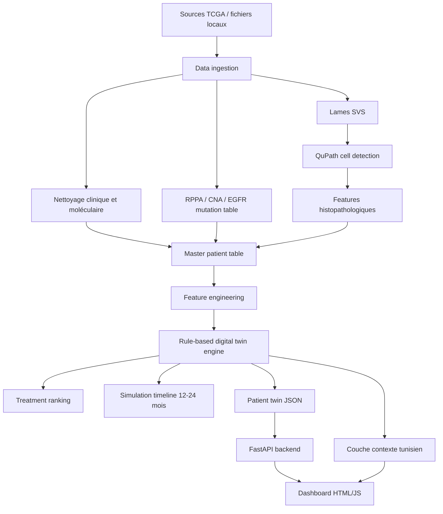

# EGFR Lung Cancer Digital Twin

Prototype PFE de **jumeau numérique pour le cancer du poumon EGFR-muté**, combinant données cliniques, moléculaires, histopathologiques et contexte tunisien afin de simuler l’évolution tumorale et de classer des options thérapeutiques.

> ⚠️ **Disclaimer médical**  
> Ce projet est un prototype académique de recherche et d’aide à la visualisation. Il ne doit pas être utilisé pour prendre une décision médicale réelle sans validation clinique, biologique, réglementaire et avis d’un spécialiste.

---

## 1. Objectif du projet

Le projet construit un pipeline complet qui permet de :

1. intégrer des données TCGA liées au cancer du poumon ;
2. fusionner des données cliniques, moléculaires, protéomiques RPPA, CNA et histopathologiques ;
3. extraire des caractéristiques cellulaires à partir de lames `.svs` via QuPath ;
4. calculer des scores biologiques interprétables ;
5. simuler l’évolution tumorale sous plusieurs traitements EGFR ;
6. générer un JSON de jumeau numérique patient ;
7. afficher les résultats dans un dashboard web ;
8. ajouter une couche de faisabilité adaptée au contexte tunisien.

---

## 2. Architecture générale



---

## 3. Rôle des notebooks analysés

### `pfe_digital_twin_master.ipynb`

Notebook de base pour la **fusion initiale multi-omique**.

Il contient :

- montage Google Drive ;
- inspection des fichiers Excel ;
- chargement des données RPPA, CNA et mutations EGFR ;
- création de tables master intermédiaires ;
- préparation du fichier final `Master_Twin_Data_Final.csv` ;
- premiers essais de téléchargement GDC pour les lames `.svs`.

Fichiers manipulés dans ce notebook :

- `S_Table_13_RPPA.xlsx`
- `S_Table_6_Copy_Number.xlsx`
- `EGFR_Mutations_Table7_Cleaned.xlsx`
- `data_rppa.txt`
- `data_cna.txt`
- `Master_Twin_Data_Final.csv`
- `Master_MultiOmics_27.csv`

---

### `datafusion.ipynb`

Notebook principal de **data fusion avancée et génération de jumeaux numériques patients**.

Il contient :

- téléchargement des lames TCGA `.svs` via `gdc-client` ;
- installation et utilisation de QuPath ;
- export de features cellulaires en CSV ;
- fusion des features histologiques avec clinique, RPPA, CNA et mutations ;
- génération de `DigitalTwin_Master_Final.csv` ;
- calcul de scores biologiques ;
- simulation tumorale dynamique ;
- ranking de traitements EGFR ;
- export de fichiers JSON patient.

Fonctions importantes repérées :

- `calculate_viability()` : estime la viabilité tumorale sous traitement ;
- `simulate_patient_tumor()` : simule volume tumoral, viabilité, effet médicament et résistance ;
- `compute_pathway_state()` : calcule les états EGFR, PI3K/AKT, MAPK/ERK, mTOR ;
- `drug_rule_model()` : scoring thérapeutique interprétable ;
- `build_timeline()` : construit la timeline d’évolution tumorale ;
- `classify_egfr_variant()` : classe les mutations EGFR ;
- `drug_rule_model_precision()` : version améliorée du scoring thérapeutique ;
- `create_precision_patient_digital_twin_json()` : export final du jumeau numérique patient.

Traitements modélisés :

- Gefitinib
- Erlotinib
- Afatinib
- Dacomitinib
- Osimertinib
- Lazertinib
- Amivantamab
- Amivantamab + Lazertinib
- Osimertinib + Chemotherapy
- Platinum-based Chemotherapy

---

### `00_MASTER_TUNISIAN_DIGITAL_TWIN.ipynb`

Notebook d’intégration finale orienté **prototype tunisien et application hospitalière**.

Il contient :

- génération de patients tunisiens de démonstration ;
- prédiction simple sur profil patient ;
- fichier de disponibilité des médicaments en Tunisie ;
- page dashboard `tunisia_multimodal.html` ;
- page hospitalière/anapath ;
- backend FastAPI ;
- stockage SQLite ;
- endpoints API ;
- système d’authentification simple ;
- audit log ;
- export FHIR-like ;
- packaging Windows avec launchers `.bat`, `.vbs` et préparation PyInstaller.

Fonctions/API repérées :

- `predict_patient()`
- `predict_case()`
- `init_db()`
- `audit()`
- `login()`
- `health()`
- `predict()`
- `save_case()`
- `list_cases()`
- `get_case()`
- `delete_case()`
- `stats()`
- `export_cases()`
- `export_fhir()`

---

## 4. Dashboard web

Le dashboard HTML/JS affiche :

- liste des patients TCGA ;
- résumé clinique ;
- profil moléculaire EGFR ;
- mutations secondaires ;
- mécanismes de résistance ;
- scores biologiques ;
- simulation dynamique du traitement ;
- graphique 12 mois ;
- interprétation médecin ;
- interprétation laboratoire/anapath ;
- ranking thérapeutique ;
- faisabilité tunisienne.

Le frontend consomme notamment :

```http
GET /api/patients
GET /api/patient/{patient_id}
```

---

## 5. Proposition de structure GitHub propre

```text
egfr-lung-cancer-digital-twin/
│
├── README.md
├── requirements.txt
├── .gitignore
├── LICENSE
│
├── notebooks/
│   ├── 01_master_multiomics_fusion.ipynb
│   ├── 02_datafusion_qupath_tcga.ipynb
│   └── 03_tunisian_digital_twin_app.ipynb
│
├── data/
│   ├── raw/                  # Non versionné : TCGA, SVS, Excel sources
│   ├── processed/            # CSV nettoyés
│   ├── demo/                 # Données de démonstration anonymisées
│   └── exports/              # JSON patients générés
│
├── src/
│   ├── ingestion/
│   │   ├── load_clinical.py
│   │   ├── load_rppa.py
│   │   ├── load_cna.py
│   │   └── load_egfr.py
│   │
│   ├── pathology/
│   │   ├── qupath_export.py
│   │   └── cell_features.py
│   │
│   ├── features/
│   │   ├── preprocessing.py
│   │   ├── scoring.py
│   │   └── mutation_classifier.py
│   │
│   ├── twin_engine/
│   │   ├── pathway_state.py
│   │   ├── drug_rules.py
│   │   ├── simulation.py
│   │   └── patient_twin.py
│   │
│   ├── tunisia_context/
│   │   ├── availability.py
│   │   └── recommendations.py
│   │
│   └── utils/
│       ├── config.py
│       └── io.py
│
├── app/
│   ├── main.py               # FastAPI backend
│   ├── database.py           # SQLite helpers
│   ├── auth.py               # Authentification simple
│   ├── schemas.py            # Pydantic models
│   └── routes/
│       ├── patients.py
│       ├── prediction.py
│       ├── cases.py
│       └── exports.py
│
├── frontend/
│   ├── index.html
│   ├── assets/
│   └── static/
│
├── scripts/
│   ├── build_master_table.py
│   ├── generate_patient_twins.py
│   ├── run_dashboard.py
│   └── package_windows.py
│
├── tests/
│   ├── test_scoring.py
│   ├── test_simulation.py
│   └── test_api.py
│
└── docs/
    ├── architecture.md
    ├── data_dictionary.md
    └── medical_disclaimer.md
```

---

## 6. Installation

### Option A — environnement local

```bash
git clone https://github.com/<username>/egfr-lung-cancer-digital-twin.git
cd egfr-lung-cancer-digital-twin
python -m venv .venv
source .venv/bin/activate  # Linux/Mac
# .venv\Scripts\activate   # Windows
pip install -r requirements.txt
```

### Option B — Google Colab

Les notebooks originaux ont été développés dans Google Colab avec Google Drive.  
Monter le Drive avant d’exécuter les notebooks :

```python
from google.colab import drive
drive.mount('/content/drive')
```

---

## 7. Dépendances principales

```txt
pandas
numpy
scikit-learn
matplotlib
fastapi
uvicorn
pydantic
python-multipart
jinja2
```

Pour la partie histopathologie :

- QuPath `0.4.3`
- GDC Client
- fichiers TCGA `.svs`

---

## 8. Pipeline de données

### Étape 1 — Ingestion TCGA

Entrées :

- données cliniques ;
- mutations EGFR ;
- RPPA ;
- CNA ;
- lames histopathologiques `.svs`.

Sortie :

```text
Master_Twin_Data_Final.csv
```

### Étape 2 — Extraction histopathologique

Les lames `.svs` sont analysées avec QuPath pour extraire :

- aire du noyau ;
- circularité nucléaire ;
- aire cellulaire ;
- ratio noyau/cellule ;
- positions spatiales ;
- métriques agrégées par patient.

Sortie :

```text
CSV_Exports/*.csv
```

### Étape 3 — Fusion multimodale

Les données cliniques, moléculaires, protéomiques et histologiques sont fusionnées par identifiant patient TCGA.

Sortie :

```text
DigitalTwin_Master_Final.csv
```

### Étape 4 — Feature engineering

Scores calculés :

- `egfr_pathway_activity`
- `tumor_aggressiveness`
- `survival_risk_score`
- `egfr_tki_response_score`

### Étape 5 — Moteur de jumeau numérique

Le moteur calcule :

- sensibilité au traitement ;
- risque de résistance ;
- activité des voies EGFR, PI3K/AKT, MAPK/ERK, mTOR ;
- timeline tumorale ;
- ranking thérapeutique ;
- explication interprétable.

Sortie :

```text
patient_twins_precision/patient_precision_<TCGA_ID>.json
```

---

## 9. Format simplifié d’un patient twin JSON

```json
{
  "patient_id": "TCGA-44-2661",
  "clinical": {
    "age": "65",
    "sex": "FEMALE",
    "tumor_stage": "Stage I",
    "survival_status": "LIVING"
  },
  "molecular": {
    "primary_egfr_mutation": "EGFR exon 19 deletion",
    "secondary_mutations": ["TP53", "MET"],
    "resistance_mechanisms": ["MET bypass signaling"]
  },
  "base_scores": {
    "egfr_pathway_activity": 0.71,
    "tumor_aggressiveness": 0.34,
    "survival_risk_score": 0.42,
    "egfr_tki_response_score": 0.63
  },
  "drug_options": [
    {
      "best_option_rank": 1,
      "drug_name": "Osimertinib",
      "predicted_efficiency": 0.78,
      "resistance_risk": 0.31,
      "timeline": []
    }
  ]
}
```

---

## 10. Lancer le backend FastAPI

```bash
uvicorn app.main:app --reload --host 127.0.0.1 --port 8000
```

Puis ouvrir :

```text
http://127.0.0.1:8000
```

Endpoints attendus :

```http
GET  /api/health
GET  /api/patients
GET  /api/patient/{patient_id}
POST /api/predict
POST /api/cases
GET  /api/cases
GET  /api/stats
GET  /api/export/cases
GET  /api/export/fhir/{case_id}
```

---

## 11. Lancer le dashboard statique

Si le backend n’est pas encore séparé, le dashboard peut être testé comme page statique :

```bash
cd frontend
python -m http.server 8080
```

Puis ouvrir :

```text
http://127.0.0.1:8080
```

---

## 12. Couche tunisienne

Le projet ajoute une couche de contextualisation locale :

- disponibilité hospitalière probable ;
- alternatives locales ;
- comparaison entre traitement optimal global et faisabilité tunisienne ;
- message d’avertissement demandant vérification auprès de la pharmacie hospitalière.

Exemple :

```json
{
  "drug": "Osimertinib",
  "tunisia_status": "Limited / requires hospital pharmacy verification",
  "alternatives": [
    "Erlotinib",
    "Gefitinib",
    "Afatinib",
    "Platinum-based chemotherapy"
  ]
}
```

---

## 13. Données sensibles et versionnement Git

Ne pas pousser dans GitHub :

- fichiers `.svs` ;
- données patients identifiantes ;
- fichiers TCGA lourds ;
- bases SQLite contenant des cas ;
- exports hospitaliers réels ;
- clés, tokens, identifiants.

Exemple `.gitignore` recommandé :

```gitignore
.venv/
__pycache__/
.ipynb_checkpoints/
*.db
*.sqlite
*.svs
*.tar
*.zip
*.log
/data/raw/
/data/private/
/data/exports/
/models/*.pkl
/models/*.joblib
.env
```

---

## 14. Roadmap technique recommandée

- [ ] Extraire les fonctions des notebooks vers `src/`.
- [ ] Créer un vrai backend FastAPI dans `app/`.
- [ ] Transformer le HTML dashboard en frontend maintenable.
- [ ] Ajouter des tests unitaires pour les scores et la simulation.
- [ ] Ajouter un fichier `data_dictionary.md`.
- [ ] Ajouter validation Pydantic des JSON patients.
- [ ] Ajouter un mode démo sans données TCGA lourdes.
- [ ] Documenter les limites cliniques du modèle.
- [ ] Ajouter CI GitHub Actions.
- [ ] Préparer un package Windows propre si nécessaire.

---

## 15. Limites actuelles

- Le modèle est principalement **rule-based** et non validé cliniquement.
- Les scores thérapeutiques sont interprétables mais simplifiés.
- La disponibilité des traitements en Tunisie doit être vérifiée localement.
- Les lames `.svs` et données TCGA sont lourdes et ne doivent pas être stockées dans Git.
- Les données de démonstration doivent rester anonymisées.

---

## 16. Citation / contexte

Projet académique PFE — Digital Twin EGFR Lung Cancer avec adaptation au contexte tunisien.

